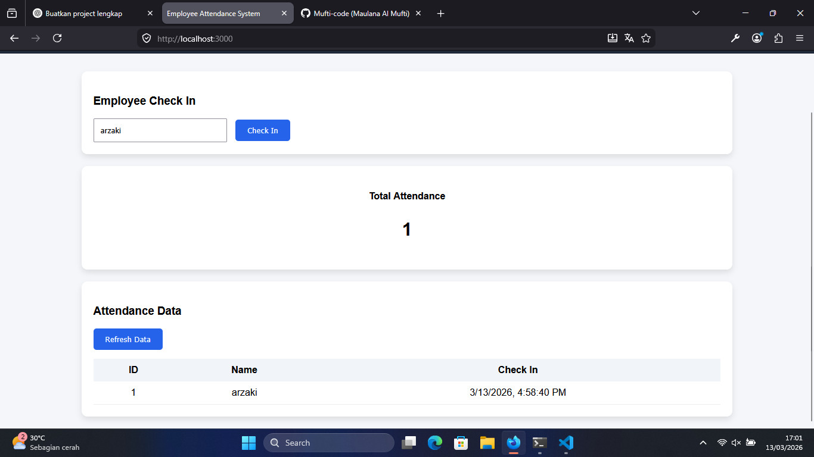

# Employee Attendance System

A simple fullstack web application for managing employee attendance.

## Features

- Employee Check-in
- Attendance Dashboard
- Attendance Table
- Total Attendance Counter

## Tech Stack

- Node.js
- Express.js
- SQLite
- HTML
- CSS
- JavaScript

## Installation

Clone the repository

```bash
git clone https://github.com/Mufti-code/employee-attendance-system.git
```

Install dependencies

```bash
npm install
```

Run the server

```bash
node server.js
```

Open in browser

```
http://localhost:3000
```

## Screenshot



## Author

Maulana Al Mufti